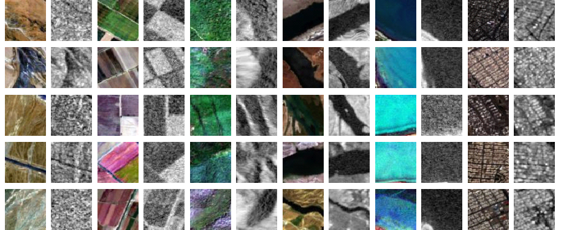

# Optical and SAR  Datasets for Land Use and Land Cover Classification 

This repository provides two co-registered and labeled datasets constructed from Sentinel-1 SAR and Sentinel-2 optical imagery for patch-level land use and land cover (LULC) classification.

  

## 📥 Download

- 🔗 [Download Optical Dataset (GeoTIFF)](https://drive.google.com/file/d/1BnE_hLPZFzGatTy_Ym_Cuc40NytcMLcz/view?usp=sharing)
- 🔗 [Download SAR Dataset (GeoTIFF)](https://drive.google.com/file/d/1iMjkdQA4_aiO_rdQUBCWB2Blb648yOR7/view?usp=sharing)

## 📂 Dataset Structure

Each dataset includes:
- 6 LULC classes: Barrenland, Farmland, Forest, River, Sea/Lake, Urban
- 600 image patches per class (64×64 pixels, 10 m resolution)
- Format: GeoTIFF (.tif) with georeferencing metadata
- Total: 3,600 patches per dataset (Optical & SAR)

Each image patch file is named and organized by class for easy access.

## 🛰 Data Sources

- Sentinel-2 (Optical) — 12 spectral bands  
- Sentinel-1 (SAR) — VV and VH polarizations from ascending & descending orbits  
- All patches are spatially co-registered
